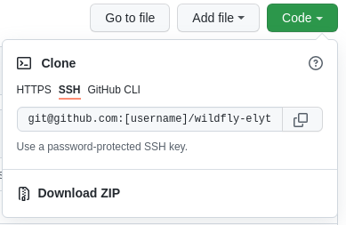

Contributing to WildFly Elytron
==================================

Welcome to the WildFly Elytron project! We welcome contributions from the community. This guide will walk you through the steps for getting started on our project.

- [Forking the Project](#forking-the-project)
- [Issues](#issues)
  - [Good First Issues](#good-first-issues)
- [Setting up your Developer Environment](#setting-up-your-developer-environment)
- [Contributing Guidelines](#contributing-guidelines)
  - [Testing](#testing)
  - [Pull Request Process](#pull-request-process)
  - [Documentation](#documentation)
- [FAQ for New Contributors](#faq-for-new-contributors)
- [Community](#community)


## Forking the Project 
To contribute, you will first need to fork the [wildfly-elytron](https://github.com/wildfly-security/wildfly-elytron) repository. 

This can be done by looking in the top-right corner of the repository page and clicking "Fork".


The next step is to clone your newly forked repository onto your local workspace. This can be done by going to your newly forked repository, which should be at `https://github.com/USERNAME/wildfly-elytron`. 

Then, there will be a green button that says "Code". Click on that and copy the URL.



Then, in your terminal, paste the following command:
```bash
git clone [URL]
```
Be sure to replace [URL] with the URL that you copied.

Now you have the repository on your computer!

## Issues
The WildFly Elytron project uses JIRA to manage issues. All issues can be found [here](https://issues.redhat.com/projects/ELY/issues). 

To create a new issue, comment on an existing issue, or assign an issue to yourself, you'll need to first [create a JIRA account](https://issues.redhat.com/).


### Good First Issues
Want to contribute to the WildFly Elytron project but aren't quite sure where to start? Check out our issues with the `good-first-issue` label. These are a triaged set of issues that are great for getting started on our project. These can be found [here](https://issues.redhat.com/issues/?filter=12383825). 

Once you have selected an issue you'd like to work on, make sure it's not already assigned to someone else. To assign an issue to yourself, simply click on "Start Progress". This will automatically assign the issue to you.


It is recommended that you use a separate branch for every issue you work on. To keep things straightforward and memorable, you can name each branch using the JIRA issue number. This way, you can have multiple PRs open for different issues. For example, if you were working on [ELY-2127](https://issues.redhat.com/browse/ELY-2127), you could use ELY-2127 as your branch name.

## Setting up your Developer Environment
You will need:

* JDK 11
* Git
* Maven 3.3.9 or later
* An [IDE](https://en.wikipedia.org/wiki/Comparison_of_integrated_development_environments#Java)
(e.g., [IntelliJ IDEA](https://www.jetbrains.com/idea/download/), [Eclipse](https://www.eclipse.org/downloads/), etc.)

For instructions that will walk you through how to install Git, Java, and Maven for your operating system, and show you how to fork and clone the WildFly Elytron project, take a look at our [setup guides](https://wildfly-security.github.io/wildfly-elytron/guides/).

First `cd` to the directory where you cloned the project (eg: `cd wildfly-elytron`)

Add a remote ref to upstream, for pulling future updates.
For example:

```
git remote add upstream https://github.com/wildfly-security/wildfly-elytron
```
To build `wildfly-elytron` run:
```bash
mvn clean install
```

To skip the tests, use:

```bash
mvn clean install -DskipTests=true
```

To run only a specific test, use:

```bash
mvn clean install -Dtest=TestClassName
```
Note: Some tests will fail if `localhost` is not listed first in `/etc/hosts` file for the loopback addresses (IPv4 and IPv6).

For more information, including details on how WildFly Elytron is integrated in WildFly Core and WildFly, check out our [developer guide](https://wildfly-security.github.io/wildfly-elytron/getting-started-for-developers/).


## Contributing Guidelines

### Testing

Ensure that your changes are thoroughly tested before submitting a pull request. Follow these testing guidelines:

- Run the existing unit tests using Maven: `mvn clean test`
- Include new unit tests for your code changes.

If applicable, provide instructions on how to run integration tests or any additional testing procedures.

### Documentation
Contributors are encouraged to keep documentation up-to-date along with code changes. If your changes impact user-facing features, update the relevant documentation files in directory.

If there are specific guidelines for documentation changes, please follow them closely.

### Pull Request Guidelines
When submitting a PR, please keep the following guidelines in mind:

1. In general, it's good practice to squash all of your commits into a single commit. For larger changes, it's ok to have multiple meaningful commits. If you need help with squashing your commits, feel free to ask us how to do this on your pull request. We're more than happy to help!

2. Please include the JIRA issue you worked on in the title of your pull request and in your commit message. For example, for [ELY-2127](https://issues.redhat.com/browse/ELY-2127), the PR title and commit message should be `[ELY-2127] Add client side TRACE logging after successful authentication`.

3. Please include the link to the JIRA issue you worked on in the description of the pull request. For example, if your PR adds a fix for [ELY-2127](https://issues.redhat.com/browse/ELY-2127), the PR description should contain a link to https://issues.redhat.com/browse/ELY-2127.

For an example of a properly formatted PR, take a look at https://github.com/wildfly-security/wildfly-elytron/pull/1532

## FAQ for New Contributors

### Q: How do I find good first issues to work on?
A: You can find issues labeled as `good-first-issue` in our [JIRA project](https://issues.redhat.com/browse/WFLY-18776?filter=12364234). These are specifically curated for new contributors to get started.

### Q: What is the process for assigning an issue to myself?
A: To assign an issue to yourself, navigate to the issue on our [JIRA](https://issues.redhat.com/projects/ELY) and click on "Start Progress." This will automatically assign the issue to you.

### Q: How should I name my feature branch?
A: It is recommended to use a branch name that includes the JIRA issue number. For example, if you are working on [ELY-1234](https://issues.redhat.com/browse/ELY-1234), your branch name could be `ELY-1234-feature-description`.

### Q: Can I work on multiple issues simultaneously?
A: Yes, you can work on multiple issues simultaneously by creating separate feature branches for each issue. This allows you to have multiple pull requests open for different issues.

### Q: I find the existing codebase complex. How can I understand it better?
A: Take your time to explore the code gradually. Start by focusing on specific modules or components. Don't hesitate to ask questions on [communication channels](https://wildfly-security.github.io/wildfly-elytron/community/) if something is unclear.

### Q: What should I do if I encounter build or test failures?
A: Run 'mvn clean test' to identify and address build or test failures. If needed, seek help on community channels, and include details about the issue you're facing.

### Q: How do I run tests before submitting a pull request?
A: To run tests, use the following Maven command: `mvn clean test`. Additionally, include new unit tests for your code changes.

### Q: How should I handle feedback on my contributions?
A: Embrace feedback as a learning opportunity. Review and address comments provided by maintainers or community members, and consider it a collaborative effort to improve your contributions.
Remember, we value your contributions and are here to support you throughout the process. Don't hesitate to seek assistance and enjoy your journey as a contributor!

### Q: What should I do if I encounter issues during the contribution process?
A: If you encounter any issues or have questions, feel free to reach out to the community on our [communication channels](https://wildfly-security.github.io/wildfly-elytron/community/). We are here to help!

## Community
For more information on how to get involved with WildFly Elytron, check out our [community](https://wildfly-security.github.io/wildfly-elytron/community/) page.6